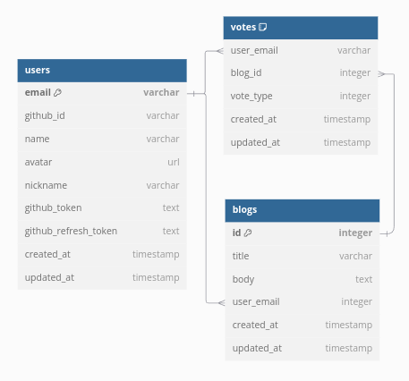
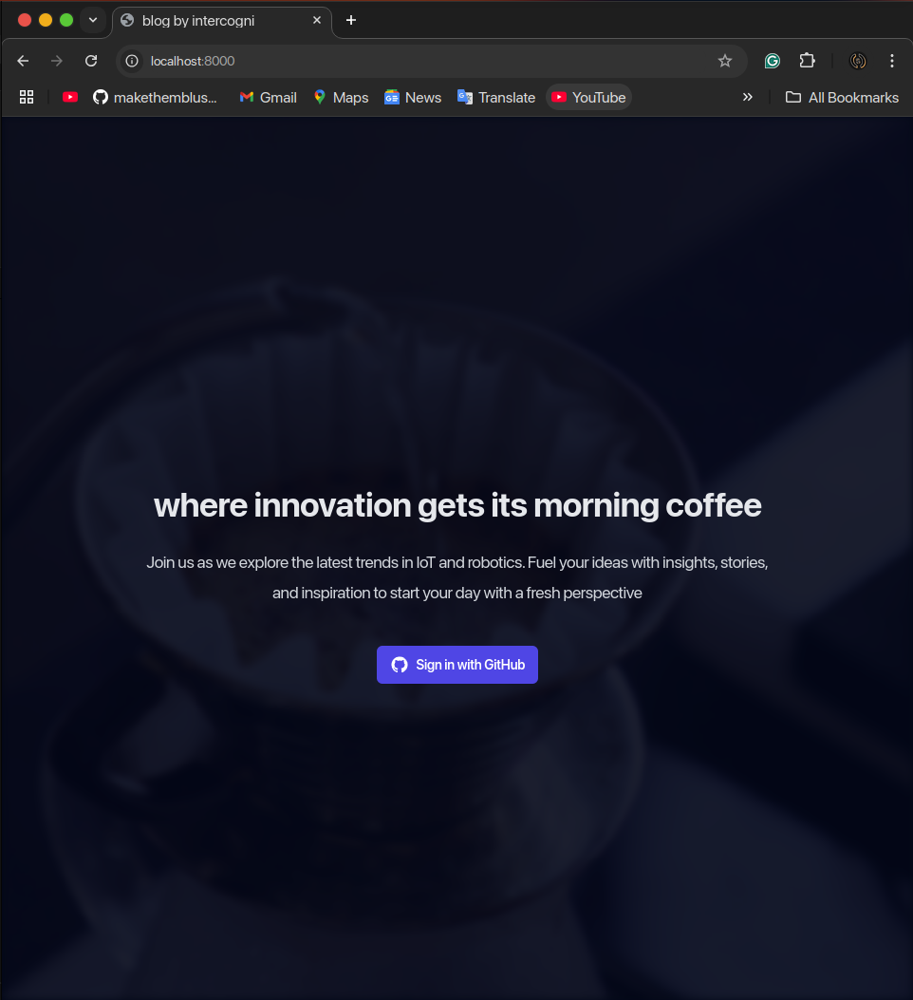
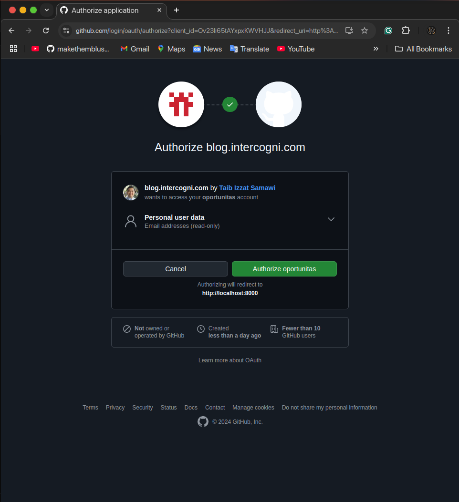
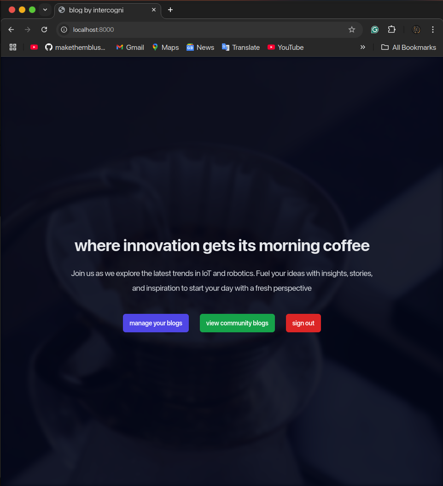
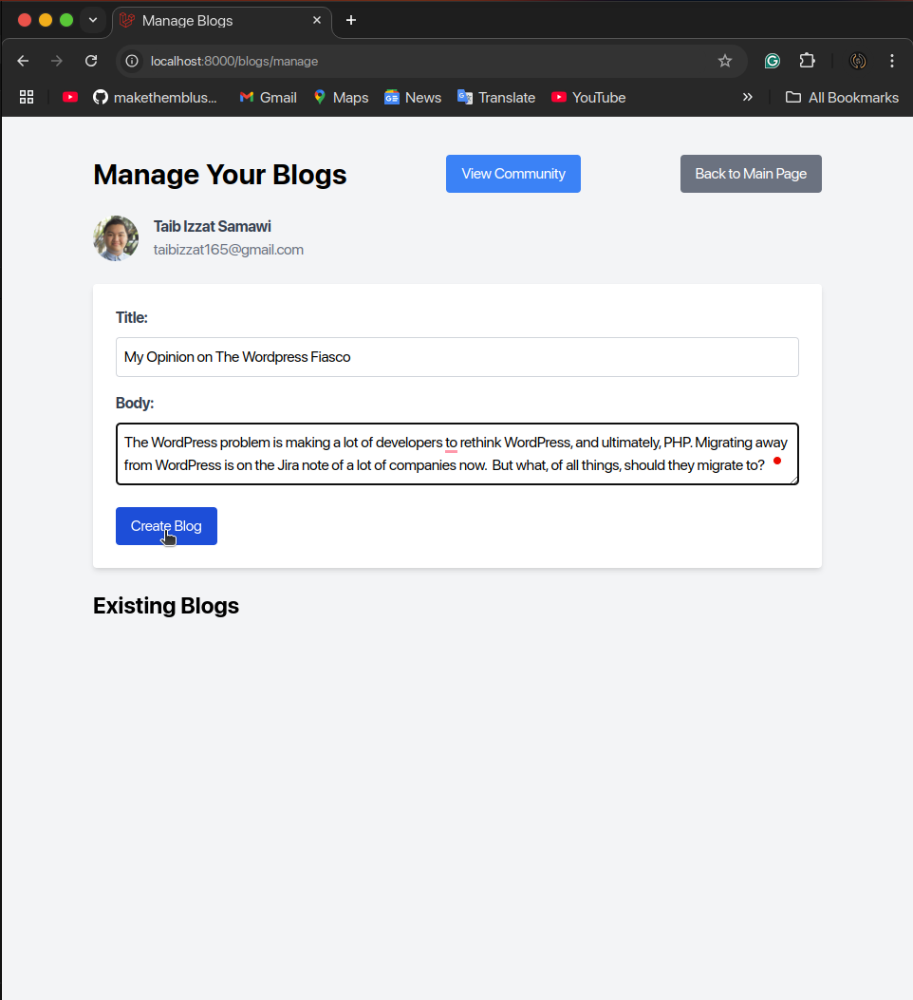
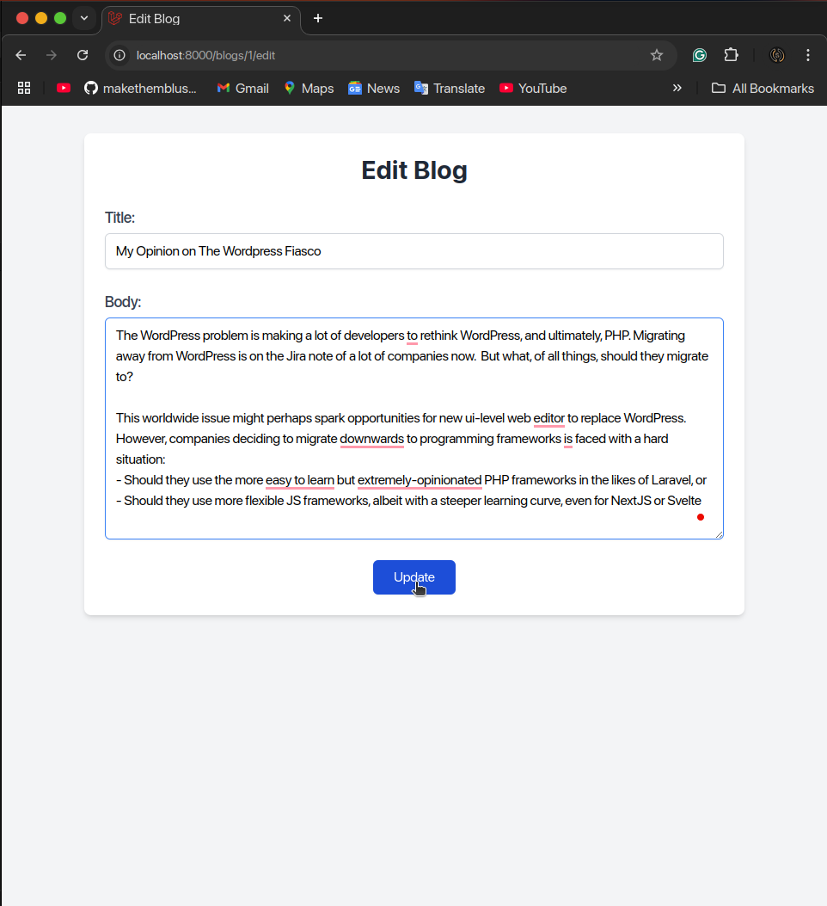
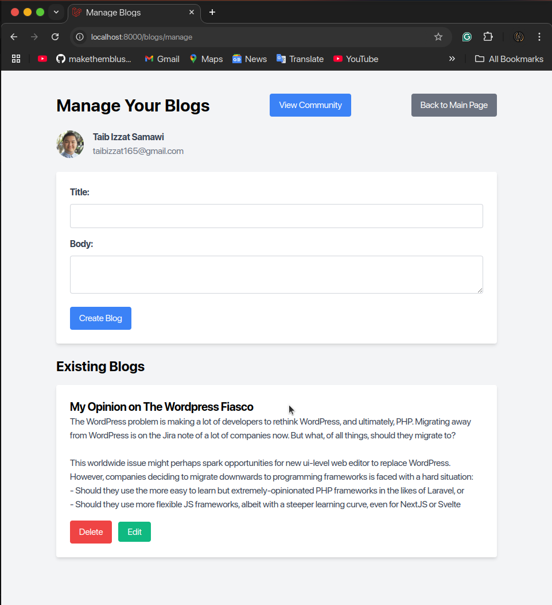
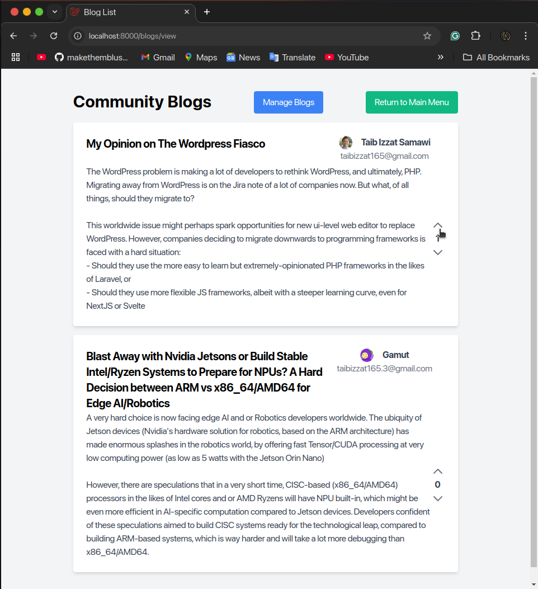
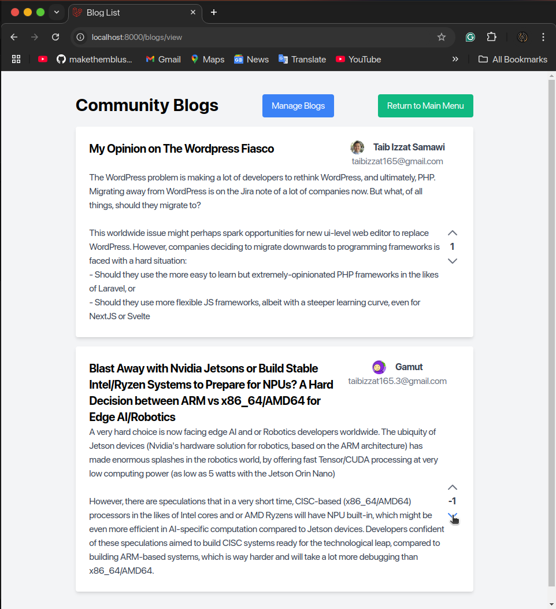

# 🌐 `blog.intercogni.com`
> `blog.intercogni.com`'s purpose is to be a website to store blogs regarding IoT, 🤖 Robotics, and other tech topics.

> The website is created using `Laravel`, the full-stack highly-opinionated web-programming framework.

# 📚 Table of Contents

- [🌐 `blog.intercogni.com`](#-blogintercognicom)
- [📚 Table of Contents](#-table-of-contents)
- [✨ Features](#-features)
- [🗂️ Database/Model Diagram](#️-databasemodel-diagram)
- [🎥 Demo Video](#-demo-video)
- [📸 Screenshots](#-screenshots)
	- [🏠 Home Page Before Login](#-home-page-before-login)
	- [🔑 GitHub Authentication Screen](#-github-authentication-screen)
	- [🏠 Home Page After Login](#-home-page-after-login)
	- [✍️ Creating a New Blog](#️-creating-a-new-blog)
	- [✏️ Editing a Blog](#️-editing-a-blog)
	- [📝 Blog After Edit](#-blog-after-edit)
	- [🌐 Community Blogs](#-community-blogs)
	- [👍 Upvoting](#-upvoting)
	- [👎 Downvoting](#-downvoting)
- [⚙️ Installation](#️-installation)
	- [🌐 API Endpoints](#-api-endpoints)

# ✨ Features

- **🔐 User Authentication**: Users can authenticate using their GitHub accounts.
- **📝 Blog Management**: Users can create, edit, and delete their blog posts.
- **🌍 Community Interaction**: Users can view, upvote, and downvote blog posts from the community.

# 🗂️ Database/Model Diagram


# 🎥 Demo Video


# 📸 Screenshots

## 🏠 Home Page Before Login

This is the home page of the website before the user logs in.

## 🔑 GitHub Authentication Screen

The screen where users can authenticate using their GitHub account.

## 🏠 Home Page After Login

The home page displayed after the user has successfully logged in.

## ✍️ Creating a New Blog

The interface for creating a new blog post.

## ✏️ Editing a Blog

The interface for editing an existing blog post.

## 📝 Blog After Edit

The blog post after it has been edited.

## 🌐 Community Blogs

A section displaying blogs from the community.

## 👍 Upvoting

The feature allowing users to upvote a blog post.

## 👎 Downvoting

The feature allowing users to downvote a blog post.

# ⚙️ Installation

1. 📥 Clone the repository:
	```sh
	git clone https://github.com/yourusername/blog.intercogni.com.git
	cd blog.intercogni.com
	```

2. 📦 Install dependencies:
	```sh
	composer install
	npm install
	```

3. 📄 Import the `.env` file, **please ask the code owner** for the `.env` file

4. 🔑 Generate the application key:
	```sh
	php artisan key:generate
	```

5. 🗄️ Run database migrations:
	```sh
	php artisan migrate
	```

6. 🛠️ Build the Vite Frontend helper through npm:
	```sh
	npm run build
	```

6. 🚀 Start the development server:
	```sh
	php artisan serve
	```

## 🌐 API Endpoints
- `POST` `/blogs/{id}/add`: Add/create a blog.
- `GET` `/blogs/{id}/edit/apply`: Apply edit changes to a certain post.
- `DELETE` `/blogs/{id}/delete`: Delete a blog.
- `POST` `/blogs/{id}/upvote`: Upvote a blog.
- `POST` `/blogs/{id}/downvote`: Downvote a blog.